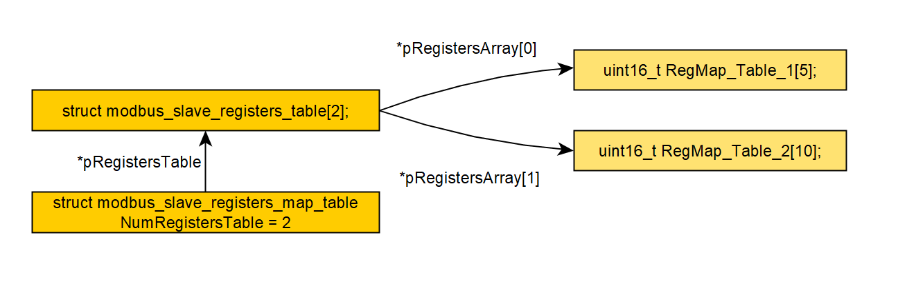

# MModBus

### Note
Простая реализация протокола ModBusRTU.

Спецификация ModBus: [Modbus Specifications and Implementation Guides](http://www.modbus.org/specs.php)


## Описание

#### Требования:
1) Таймер
2) UART
3) ROM ~ 4K
4) RAM ~ 512B

#### Регистры



**The registers:**
```C
struct modbus_slave_registers_table {
        uint8_t  ACCESS;
        uint16_t START_ADDR;
        uint16_t SIZE_ARR;
        uint16_t *pRegistersArray;
};

struct modbus_slave_registers_map_table {
    struct modbus_slave_registers_table *pRegistersTable;
    uint8_t	NumRegistersTable;
};
```

**The registers API:**
```C
void ModBus_Slave_Init_Registers_Map_Table(
    struct modbus_slave_registers_map_table *pRegistersMapTable,
    struct modbus_slave_registers_table *pRegistersTable,
    uint8_t NumRegistersTable);

void ModBus_Slave_Init_Registers_Table(
    struct modbus_slave_registers_table  *pRegistersTable,
    uint16_t *pRegistersArray,
    uint8_t  ACCESS,
    uint16_t START_ADDR,
    uint16_t SIZE_ARR);
    
    
void WriteModBusReg(struct modbus_slave_registers_map_table *pRegistersMapTable, uint16_t DataReg, uint16_t Address);

uint16_t ReadModBusReg(struct modbus_slave_registers_map_table *pRegistersMapTable, uint16_t Address);
```

**Необходимо реализовать:**

```C
struct modbus_rtu_slave_function {
    // Инициализация UART
    void (*pModBusRTU_Slave_UART_Init)(uint8_t Speed);
    // Разрешить прерывание по окончанию передачи
    void (*pModBusRTU_Slave_Enable_Inter_Trans_Phisic)(void);
    // Запретить прерывание по окончанию передачи
    void (*pModBusRTU_Slave_Disable_Inter_Trans_Phisic)(void);
    // Разрешить прерывание по приему байта
    void (*pModBusRTU_Slave_Enable_Inter_Receiv_Phisic)(void);
    // Запретить прерывание по приему байта
    void (*pModBusRTU_Slave_Disable_Inter_Receiv_Phisic)(void);
    // Передача байта
    void (*pModBusRTU_Slave_UART_Write_Phisic)(uint8_t Data);

    // Инициализация Таймера
    void (*pModBusRTU_Slave_Timer_Init)(uint8_t Speed);
    // Запустить таймер
    void (*pModBusRTU_Slave_Timer_Start)(void);
    // Стоп таймер
    void (*pModBusRTU_Slave_Timer_Stop)(void);

    // Направление линии на прием
    void (*pModBusRTU_Slave_RTS1_RX)(void);
    // Направление линии на передачу
    void (*pModBusRTU_Slave_RTS1_TX)(void);
};
```

### Example
Пример можно посмотреть ту: [MModBus/sources/example/](https://github.com/Kefir0192/MModBus/tree/master/sources/example)

**Main:**
```C
struct modbus_rtu_slave ModBusRTU_Slave;
struct modbus_slave_registers_table ModBusRTU_Slave_RegistersTable[2];
struct modbus_slave_registers_map_table ModBusRTU_Slave_RegistersMapTable;

// ACCESS_REG_RO
// RegMap_Table_1
uint16_t RegMap_Table_1[5];

// ACCESS_REG_RW
// RegMap_Table_2
uint16_t RegMap_Table_2[10];

// Приемопередающий буфер
uint8_t ModBusRTU_Slave_RxTxBuff[257];


void ModBusRTU_Slave_Init_1(void)
{
    // Инициализировать таблицу регистров #1
    ModBus_Slave_Init_Registers_Table(&ModBusRTU_Slave_RegistersTable[0],
                                      RegMap_Table_1,
                                      ACCESS_REG_RO,
                                      0, 5);

    // Инициализировать таблицу регистров #2
    ModBus_Slave_Init_Registers_Table(&ModBusRTU_Slave_RegistersTable[1],
                                      RegMap_Table_2,
                                      ACCESS_REG_RW,
                                      5, 10);

    // Инициализирует карту таблиц регистров
    ModBus_Slave_Init_Registers_Map_Table(&ModBusRTU_Slave_RegistersMapTable,
                                          ModBusRTU_Slave_RegistersTable, 2);


    // Инициализация ModBusRTU_Slave
    ModBusRTU_Slave_Init(&ModBusRTU_Slave, &ModBusRTU_Slave_RegistersMapTable,
                         ModBusRTU_Slave_RxTxBuff);


    //------------------------
    ModBusRTU_Slave.FunctionPeriphery.pModBusRTU_Slave_Disable_Inter_Receiv_Phisic =
            ModBusRTU_Slave_Disable_Inter_Receiv_Phisic;

    ModBusRTU_Slave.FunctionPeriphery.pModBusRTU_Slave_Disable_Inter_Trans_Phisic =
            ModBusRTU_Slave_Disable_Inter_Trans_Phisic;

    ModBusRTU_Slave.FunctionPeriphery.pModBusRTU_Slave_Enable_Inter_Receiv_Phisic =
            ModBusRTU_Slave_Enable_Inter_Receiv_Phisic;

    ModBusRTU_Slave.FunctionPeriphery.pModBusRTU_Slave_Enable_Inter_Trans_Phisic =
            ModBusRTU_Slave_Enable_Inter_Trans_Phisic;

    ModBusRTU_Slave.FunctionPeriphery.pModBusRTU_Slave_RTS1_RX = ModBusRTU_Slave_RTS1_RX;
    ModBusRTU_Slave.FunctionPeriphery.pModBusRTU_Slave_RTS1_TX = ModBusRTU_Slave_RTS1_TX;

    ModBusRTU_Slave.FunctionPeriphery.pModBusRTU_Slave_Timer_Init =
            ModBusRTU_Slave_Timer_Init;

    ModBusRTU_Slave.FunctionPeriphery.pModBusRTU_Slave_Timer_Start =
            ModBusRTU_Slave_Timer_Start;

    ModBusRTU_Slave.FunctionPeriphery.pModBusRTU_Slave_Timer_Stop =
            ModBusRTU_Slave_Timer_Stop;

    ModBusRTU_Slave.FunctionPeriphery.pModBusRTU_Slave_UART_Init =
            ModBusRTU_Slave_UART_Init;

    ModBusRTU_Slave.FunctionPeriphery.pModBusRTU_Slave_UART_Write_Phisic =
            ModBusRTU_Slave_UART_Write_Phisic;
    //------------------------
}

int main(void)
{
    // Hardware initialization
    Hardware_Init();

    ModBusRTU_Slave_Init_1();
    ModBusRTU_Slave_Init_Addr_Speed(&ModBusRTU_Slave, 0x01, SP_9600);


    RegMap_Table_1[0] = 0x01;
    RegMap_Table_1[1] = 0x02;

    RegMap_Table_2[0] = 0x03;
    RegMap_Table_2[1] = 0x04;

    while(1) {
        ModBusRTU_Slave_Service(&ModBusRTU_Slave);
    }
}
```


## License

[BSD](./LICENSE).